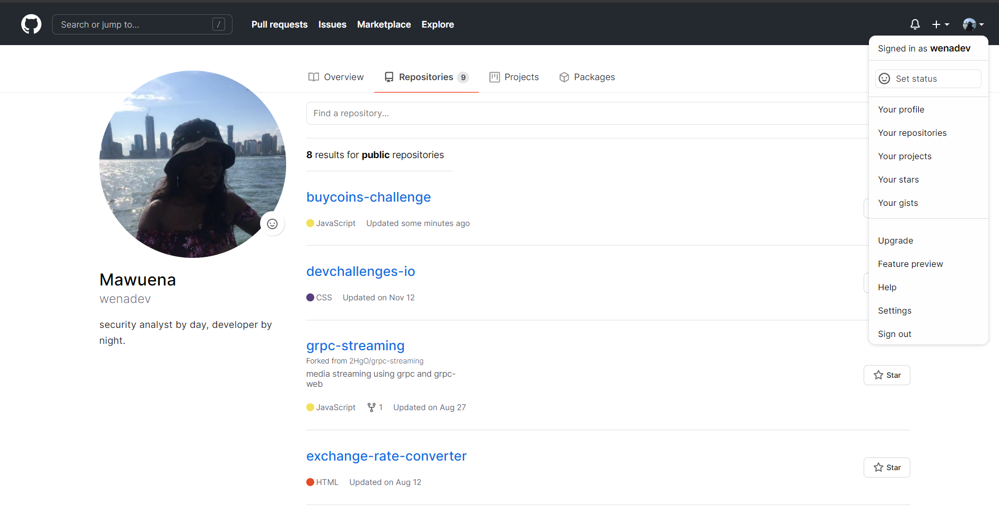

<h1 align="center">BuyCoins Challenge</h1>

   Solution to the challenge for front-end engineers.

  <h3>
    <a href="https://wenadev-repo-clone.netlify.app/">
      Live Demo
    </a>
     | 
    <a href="https://github.com/wenadev/buycoins-challenge">
      Code Solution
    </a>
  </h3>

<!-- TABLE OF CONTENTS -->

## Table of Contents

- [Overview](#overview)
  - [Built With](#built-with)
- [Contact](#contact)

<!-- OVERVIEW -->

## Overview
- The project was built with [Github's GraphQL API](https://developer.github.com/v4/explorer/)
- Challenge was to recreate a github page that lists out my personal repositories.

### Built With

- HTML
- CSS
- Vanilla Javascript

## Contact

- GitHub [@wenadev](https://github.com/wenadev)
- Twitter [@mawuennaa](https://twitter.com/mawuennaa)
- LinkedIn [@Temitayo Hayes](https://www.linkedin.com/in/temitayo-hayes-86426a17a/)
